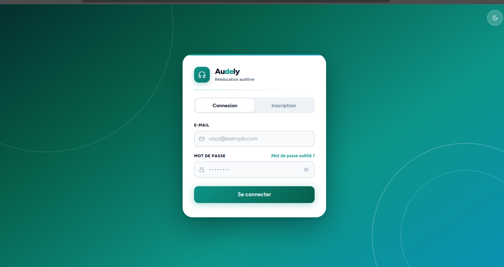
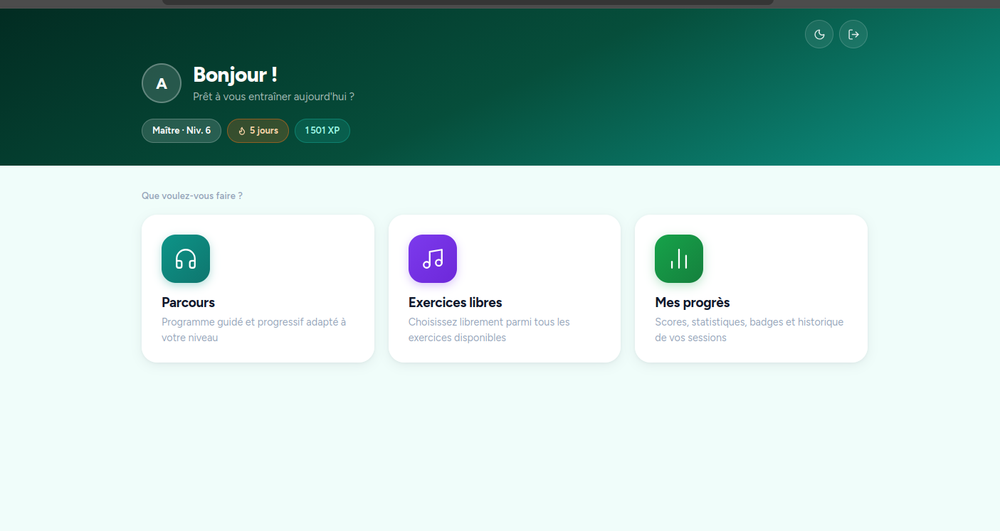
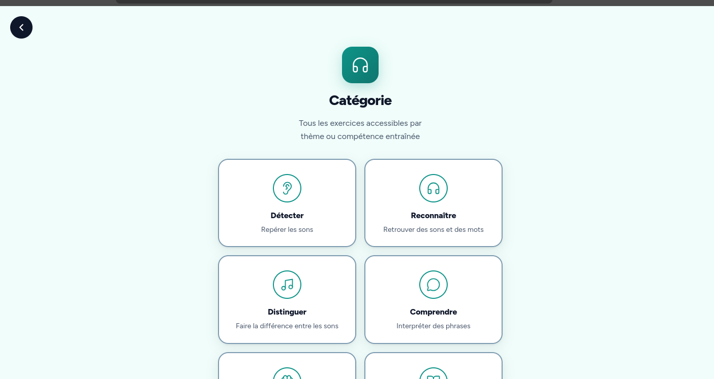
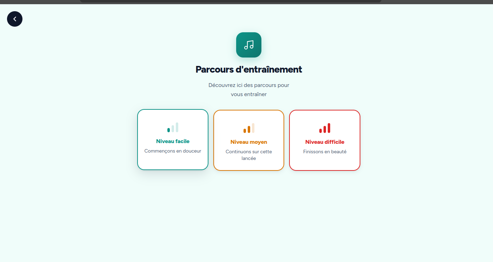
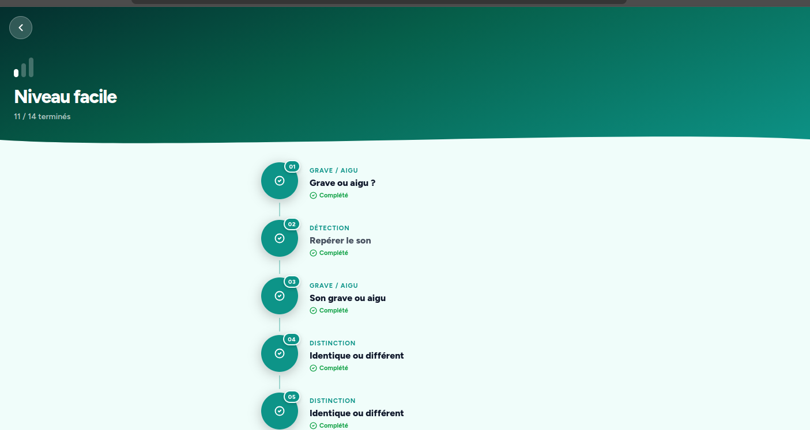
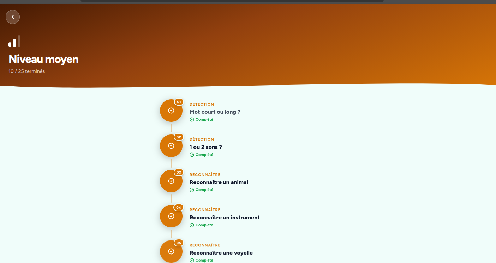
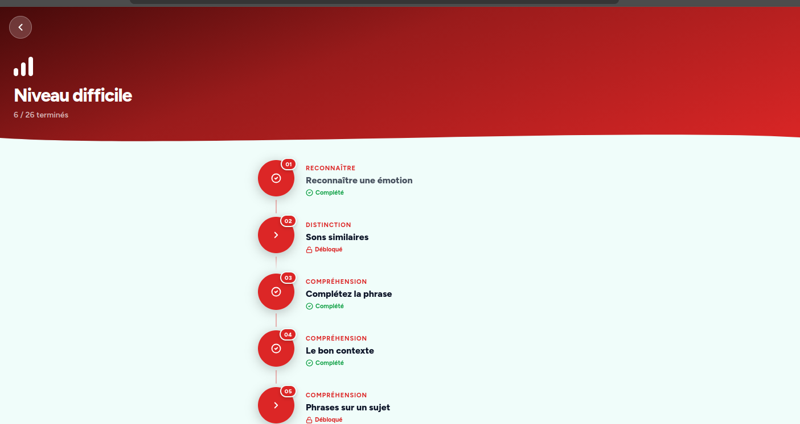
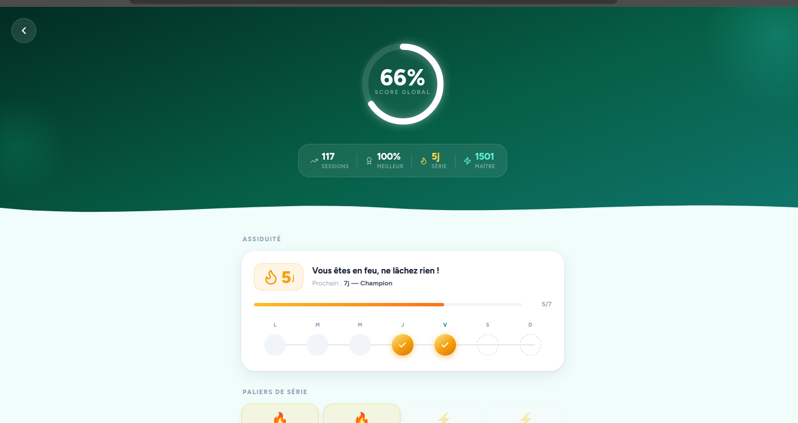
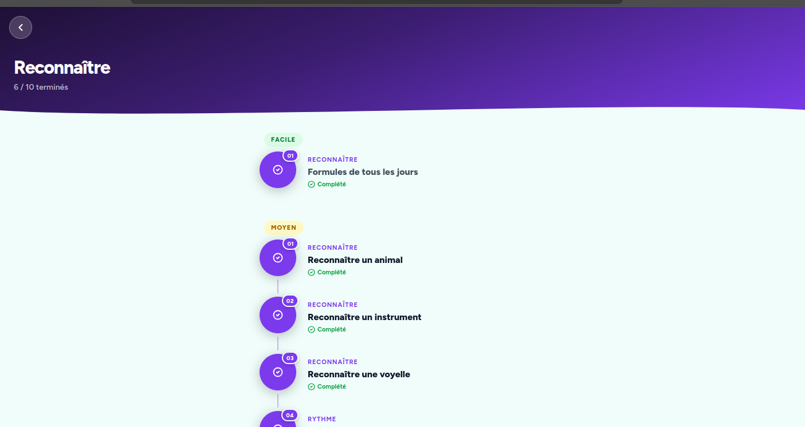
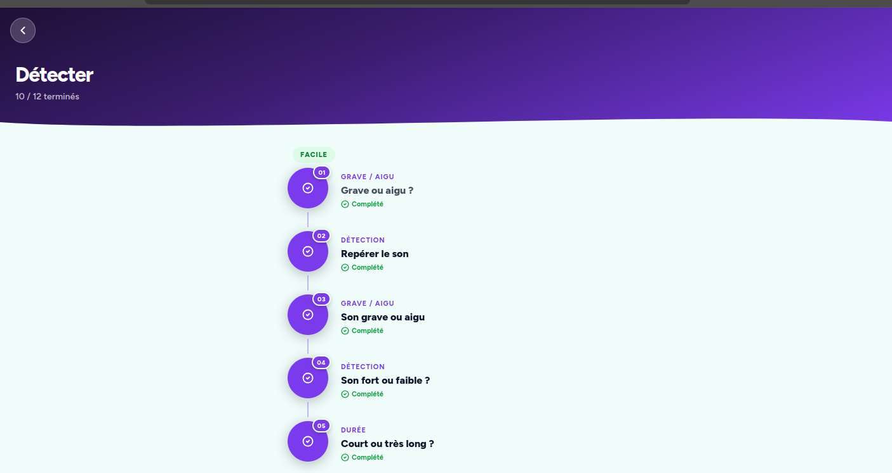

# Audely — Application de rééducation auditive

Audely est une application web de rééducation auditive destinée aux personnes malentendantes ou implantées cochléaires. Elle propose des exercices progressifs pour réapprendre à distinguer, reconnaître et comprendre les sons du quotidien — en complément des séances d'orthophonie, pour s'entraîner entre les rendez-vous et progresser plus rapidement.

---

## Captures d'écran

### Connexion


### Tableau de bord


### Exercices libres — Catégories


### Parcours d'entraînement


| Niveau facile | Niveau moyen | Niveau difficile |
|---|---|---|
|  |  |  |

### Statistiques


### Liste d'exercices
| Reconnaître | Détecter |
|---|---|
|  |  |

---

## Stack technique

| Côté | Technologies |
|---|---|
| Frontend | React 18 · TypeScript · Vite · CSS custom |
| Backend | Node.js · Express · TypeScript |
| Base de données | MySQL 8 |
| Auth | JWT (JSON Web Tokens) |
| Audio | Web Audio API · Synthèse vocale (TTS via proxy Google) |

---

## Installation

### Prérequis
- Node.js 18+
- MySQL 8+

### 1. Cloner le repo
```bash
git clone git@github.com:SolPoney/audely-desktop.git
cd audely-desktop
```

### 2. Base de données
```bash
# Créer la base
mysql -u <user> -p -e "CREATE DATABASE audely_desktop CHARACTER SET utf8mb4;"

# Importer le schéma + toutes les données (un seul fichier)
mysql -u <user> -p audely_desktop < BDD/setup_complet.sql
```

### 3. Backend
```bash
cd backend
cp .env.example .env
# Remplir les identifiants dans .env
npm install
npm run dev
```

### 4. Frontend
```bash
cd frontend
npm install
npm run dev
```

L'app est accessible sur `http://localhost:5173`

---

## Fonctionnalités

- **Authentification** — Inscription / Connexion sécurisée par JWT
- **Dashboard** — Vue d'ensemble de la progression, niveau et XP
- **Parcours guidé** — Exercices débloqués progressivement (Facile → Moyen → Difficile)
- **Exercices libres** — Accès libre à toutes les catégories
- **8 types d'exercices** :
  - Détecter un son (bip interactif)
  - Grave ou Aigu
  - Court / Moyen / Long
  - Identique ou Différent
  - Reconnaître le rythme
  - Décision orthographique
  - Exercice partenaire (formules, mots, phrases…)
  - Mot similaire (quasi-homophones)
- **Statistiques** — Score global, assiduité, paliers de série, historique par type d'exercice
- **Mode sombre** — Thème clair / sombre

---

## Structure du projet

```
audely-desktop/
├── frontend/          # React + TypeScript (Vite)
│   └── src/
│       ├── components/    # Composants exercices
│       ├── pages/         # Pages de l'app
│       ├── hooks/         # useAuth, useTheme
│       └── index.css      # Styles globaux
├── backend/           # Node.js + Express + TypeScript
│   └── src/
│       ├── controllers/   # Auth, exercices, résultats, stats, TTS
│       ├── routes/
│       └── middlewares/
├── BDD/
│   ├── setup_complet.sql  # Schéma + données (tout-en-un)
│   └── MLD.jpg            # Modèle logique de données
└── screenshots/
```

